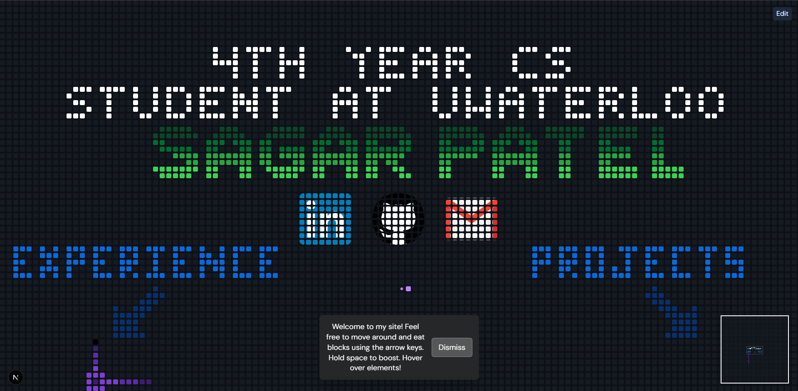
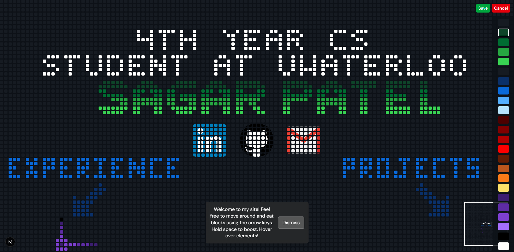
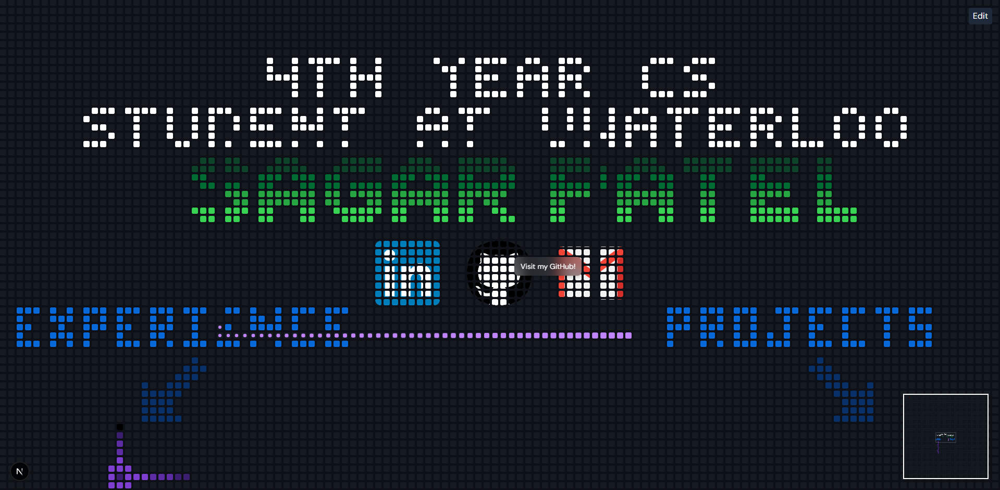

# My Portfolio

Visit my portfolio website at [https://www.sagarpatel211.me](https://www.sagarpatel211.me)

## To Do

- [ ] draw all icons like frameworks and langs and job experience
- [ ] Create proper GitHub project card images for:
  - [ ] Currently using temporary images (1.png, 2.png, 3.png) for testing
  - [ ] Create dedicated project card images when ready

### GitHub Project Card Image Guidelines

- Size: At least 200x100 pixels (will be scaled by the mosaic system)
- Content should include:
  - Project title/logo
  - Visual representation of the project (screenshot or illustration)
  - Simple design with good contrast against the dark background
  - Optional GitHub icon or styling to make it clear it's a GitHub project

## Preview







## Tech Stack

- Next.js
- Tailwind CSS
- TypeScript
- Hosted on Vercel

## Getting Started

First, run the development server:

```bash
pnpm install
pnpm dev
```

Open [http://localhost:3000](http://localhost:3000) with your browser to see the result.

## Contributing

- Sagar Patel (sagarpatel211)
